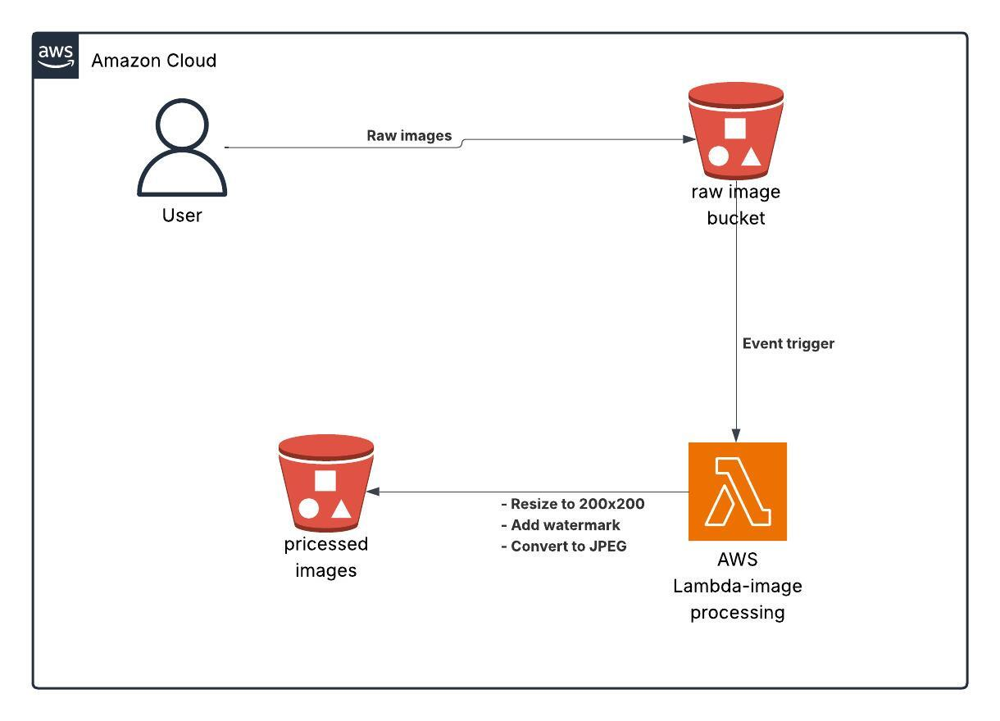

# 🖼️ Serverless Image Processing Application

A robust serverless application that automatically processes images uploaded to AWS S3 using Lambda functions. The application provides automatic image resizing and watermarking capabilities, demonstrating a practical implementation of serverless architecture.

## 🎯 Features

- **Automatic Processing**: Images are automatically processed upon upload to S3
- **Image Resizing**: Converts images to thumbnails (200x200 pixels)
- **Watermarking**: Adds custom watermark to processed images
- **Serverless Architecture**: Utilizes AWS Lambda for efficient, scalable processing
- **Secure Storage**: Processed images are stored in a separate S3 bucket

## 🏗️ Architecture Overview

The application follows a simple yet effective serverless architecture:

1. Images are uploaded to the raw-images-bucket in S3
2. Upload event triggers AWS Lambda function automatically
3. Lambda processes the image (resizing + watermarking)
4. Processed images are stored in my-processed-images-123 bucket

## 🚀 Prerequisites

- AWS Account with appropriate permissions
- Python 3.x
- AWS CLI configured locally
- Basic understanding of AWS services (S3, Lambda, IAM)

## ⚙️ Setup Instructions

1. **Clone the Repository**
   ```bash
   git clone https://github.com/MohAli2106/Serverless-Image-Processing-with-S3-and-Lambda.git
   cd Serverless-Image-Processing-with-S3-and-Lambda
   ```

2. **Configure AWS Resources**
   - Create two S3 buckets:
     - One for raw images (raw-images-bucket)
     - One for processed images (my-processed-images-123)
   - Set up appropriate IAM roles and permissions

3. **Deploy Lambda Function**
   - Upload lambda_function.py to AWS Lambda
   - Configure environment variables if needed
   - Set up S3 trigger for the raw images bucket

## 🛠️ Technologies Used

- **Amazon S3**
  - Secure object storage for both raw and processed images
  - Event triggering capability

- **AWS Lambda**
  - Serverless compute service
  - Automatic scaling and pay-per-use pricing

- **Pillow (PIL)**
  - Python Imaging Library for image processing
  - Handles resizing and watermarking operations

- **IAM Roles**
  - Secure access management
  - Principle of least privilege implementation

## 📂 Project Structure

```bash
.
├── lambda_function.py        # Main Lambda function code
├── architecture-diagram.png  # Visual architecture representation
└── README.md                # Project documentation
```

## 💡 Usage

1. Ensure you have the necessary AWS permissions and resources set up
2. Upload an image to the raw-images bucket
3. The Lambda function will automatically process the image
4. Find the processed image in the processed-images bucket

## 🤝 Contributing

Contributions are welcome! Please feel free to submit a Pull Request.

## 📝 License

This project is open source and available under the [MIT License](LICENSE).

---

⭐ Don't forget to star this repository if you find it helpful!
